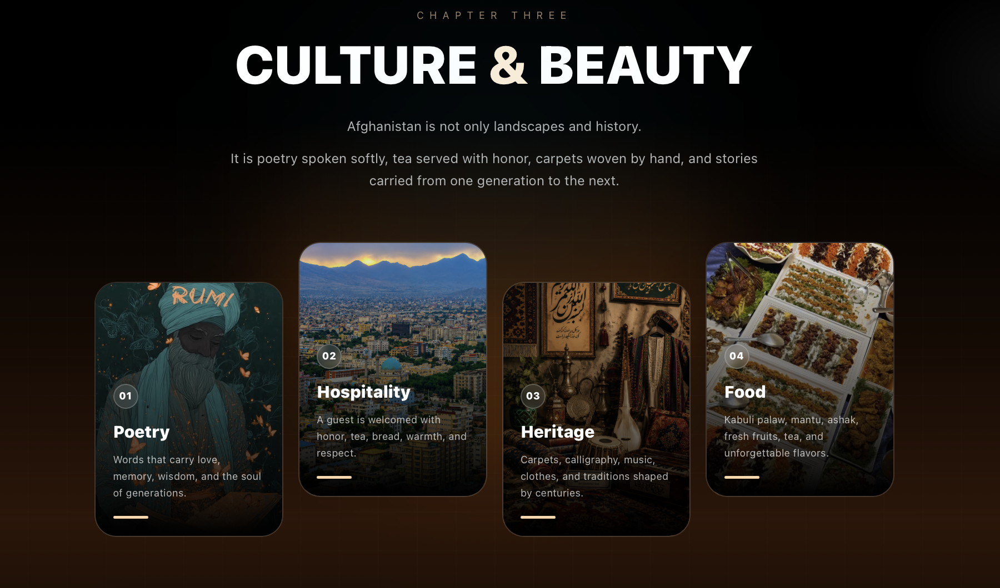
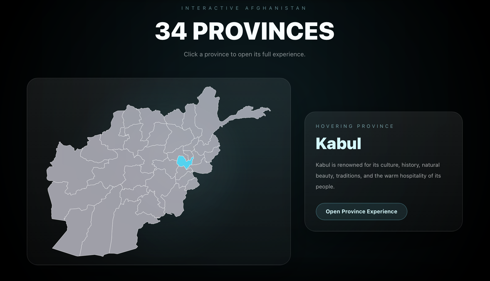
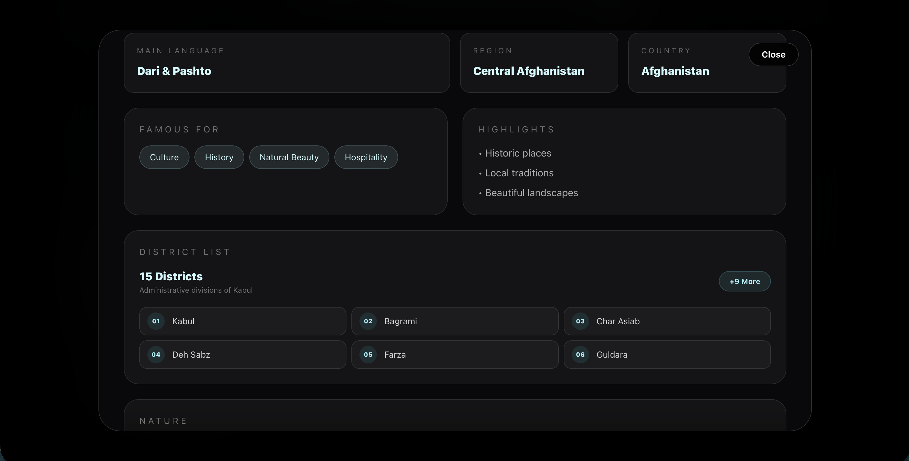
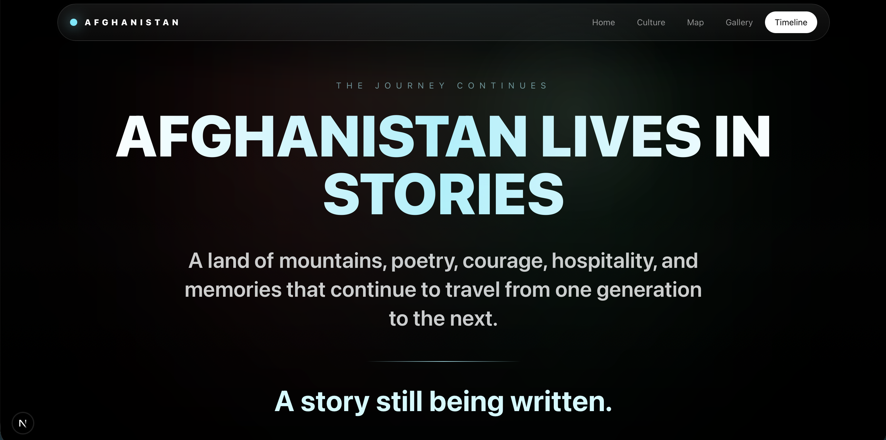

# Afghanistan Travel Story

A cinematic digital journey through Afghanistan's history, culture, landscapes, people, and provinces.

Built with modern web technologies and immersive storytelling techniques, this project transforms information into a visual experience. Visitors can explore Afghanistan through animated chapters, interactive maps, province stories, cultural highlights, and historical timelines.

---

## Preview

### Landing Page

### Scroll Chapter

### Culture Section

### Interactive Afghanistan Map

### Province Details Modal

### Province Information

### Timeline

---

# Overview

Afghanistan Travel Story is an immersive storytelling platform designed to showcase the beauty, history, culture, and diversity of Afghanistan.

Instead of presenting information through traditional pages, the project uses cinematic transitions, smooth scrolling, visual storytelling, and interactive exploration to create a unique digital experience.

The goal of the project is to allow visitors to discover Afghanistan through landscapes, traditions, provinces, historical events, famous locations, and cultural heritage.

---

# Features

## Cinematic Landing Page

- Full-screen visual experience
- Parallax movement
- Smooth transitions
- Scroll-driven storytelling
- Dynamic chapter progression
- Immersive visual atmosphere

---

## Cultural Exploration

Discover:

- Afghan traditions
- Hospitality
- Poetry
- Music
- Historical heritage
- Cultural identity

Presented through animated sections and carefully selected imagery.

---

## Interactive Afghanistan Map

Explore all 34 provinces through an interactive GeoJSON-based map.

Features include:

- Province hover effects
- Province selection
- Dynamic province details
- Province statistics
- Geographic exploration

---

## Province Experience Modal

Every province contains:

- Province introduction
- Capital city
- Population
- Area
- Region
- Main language
- District information
- Highlights
- Famous places
- Cultural overview

The modal experience is designed to feel like a digital travel guide.

---

## Province Stories

Special storytelling sections allow provinces to present:

- History
- Culture
- Traditions
- Local identity
- Famous people
- Tourist attractions

Example:

Panjshir – The Valley of the Five Lions

Featuring:

- Emerald mines
- Panjshir River
- Poetry and literature
- Traditional music
- Local cuisine
- Hospitality culture
- Ahmad Shah Massoud
- Historic landmarks

---

## Historical Timeline

The project includes an animated timeline covering important periods of Afghanistan's history.

Timeline sections present major events through cinematic cards and visual storytelling.

---

## Responsive Design

Fully optimized for:

- Desktop
- Laptop
- Tablet
- Mobile devices

---

# Technology Stack

## Frontend

- Next.js
- React
- TypeScript

## Styling

- Tailwind CSS
- Custom animations
- Modern UI design system

## Animations

- GSAP
- ScrollTrigger
- Parallax effects
- Smooth reveal animations

## Data

- GeoJSON
- Province datasets
- Custom cultural content

---

# Installation

Clone the repository:

bash git clone https://github.com/baseetnaseri6/afghanistan-travel-story.git 

Navigate into the project:

bash cd afghanistan-travel-story 

Install dependencies:

bash npm install 

Start development server:

bash npm run dev 

Open:

text http://localhost:3000 

---

# Future Roadmap

- Province search
- Province filters
- Multi-language support
- Audio ambience
- Enhanced historical timeline
- Additional province stories
- Tourist destination database
- Advanced GSAP transitions

---

# Purpose

This project was created to celebrate Afghanistan's natural beauty, cultural richness, historical depth and the diversity of its people through modern web storytelling.

It combines technology, design, and culture to create an engaging and educational digital experience.

---

# Author

Mohammad Baseet Naseri

